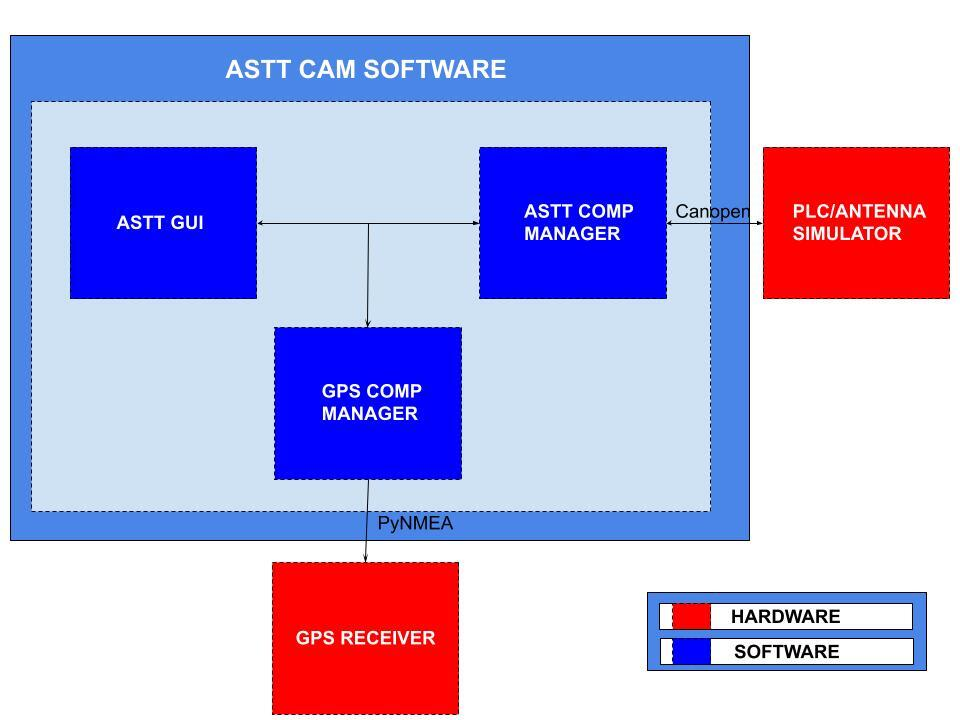

.. ASTT CAM Software documentation master file, created by
   sphinx-quickstart on Mon Jan 29 12:06:24 2024.
   You can adapt this file completely to your liking, but it should at least
   contain the root `toctree` directive.

Welcome to the ASTT CAM Software documentation
==============================================

The ASTT CAM software serves as the central control and monitoring system for the AVN Satellite Teaching Telescope.
This advanced software is designed to monitor various sensors and direct the telescope to move in specific directions, namely azimuth (Az) and elevation (El). 
The current architecture of our Telescope Simulation and STT CAM system is centered around a simulated environment that ensures precise telescope simulation and robust testing capabilities.

The ASTT CAM system is composed of three primary components: a Graphical User Interface (GUI), a Component Manager, and a Telescope Simulator. 
The GUI, developed as a web-based interface, allows users to control the telescope, input commands, configure parameters, and initiate simulations. The Component Manager acts as the communication hub, bridging the GUI and the simulator through the use of the Python CANopen library. 
Additionally, the Telescope Simulator, built using C++, provides a realistic simulation environment enhanced by real-time GPS data to accurately determine the telescope's location in terms of longitude, latitude, and altitude.

.. toctree::
   :maxdepth: 2
   :caption: Contents:

   GUI<gui/index>
   Software<software/index>
   User Guide<how_to>
   Comp Manager<component_manager_api>

Indices and tables
==================

* :ref:`genindex`
* :ref:`modindex`
* :ref:`search`
