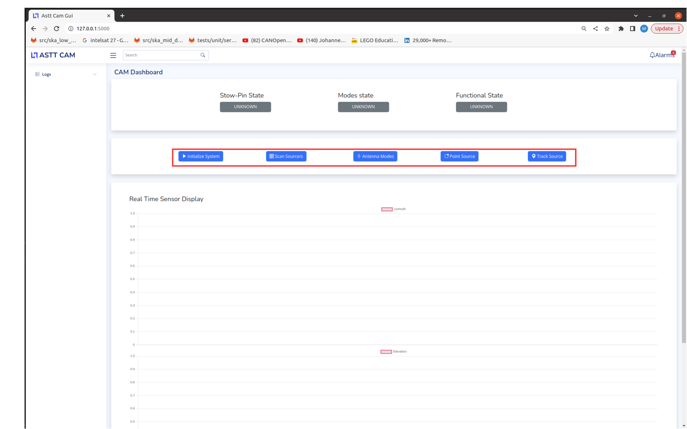

Usage
=====

**Running the Application**
To start the application, run the Flask server on your local machine.
By default, the application is accessible at:

```http://127.0.0.1:5000```


**Using the GUI**
Once you open the GUI in your browser, you will see several buttons that allow you to interact with the system. 
Below is an overview of the available functionalities and the necessary steps to perform antenna operations.



Buttons and Their Functions

1. **Initialize System**

   **Description**: This is the first step to perform any antenna operation.
   
   **Function**: Starts a VCAN network, runs the antenna simulator on a Docker container, and subscribes to relevant sensors on the simulator.
   
   **Steps to Use**:
   
       Click on the "Initialize System" button.
       
       You will be prompted with a modal to enter your system password.
       
       Enter your password and click submit.
       
       Wait for the system to start and confirm initialization.
       
       Confirmation of initialization:
       
          * Stow pin state reports ENGAGED
          
          * Mode state reports IDLE
          
          * Functional state reports BRAKED

2. **Scan Sources**
   Currently the scan Sources button is not functional.

3. **Antenna Modes**

    **Description**: Allows you to choose the operational mode of the antenna.

    **Modes**:

        IDLE: The antenna is in a standby state.

        POINT: The antenna is ready to point to a specified azimuth and elevation.

        STOW: The antenna is parked in its default stowed position.

    **Steps to Use**:

        Click on the "Antenna Modes" button.

        Select the desired mode (IDLE, POINT, or STOW).

        Confirm the mode selection to change the antenna's operational state.
   
4. **Point Source**

    **Description**: Allows you to manually point the antenna to a specific azimuth and elevation.

    **Function**: Adjusts the antenna's direction based on user input.

    **Steps to Use**:

        Click on the "Point Source" button.

        Enter the desired azimuth and elevation values and submit.

        Confirm to point the antenna to the specified direction.

5. **Track Source**

    **Description**: Enables the antenna to automatically track a specific source, such as the sun or an Intel satellite.
    
    **Function**: Uses predefined algorithms to follow the chosen source.
    
    **Steps to Use**:

        Click on the "Track Source" button.

        Select the source you want to track (e.g., Sun, Intel Satellite).
        
        The system will start tracking the chosen source.


